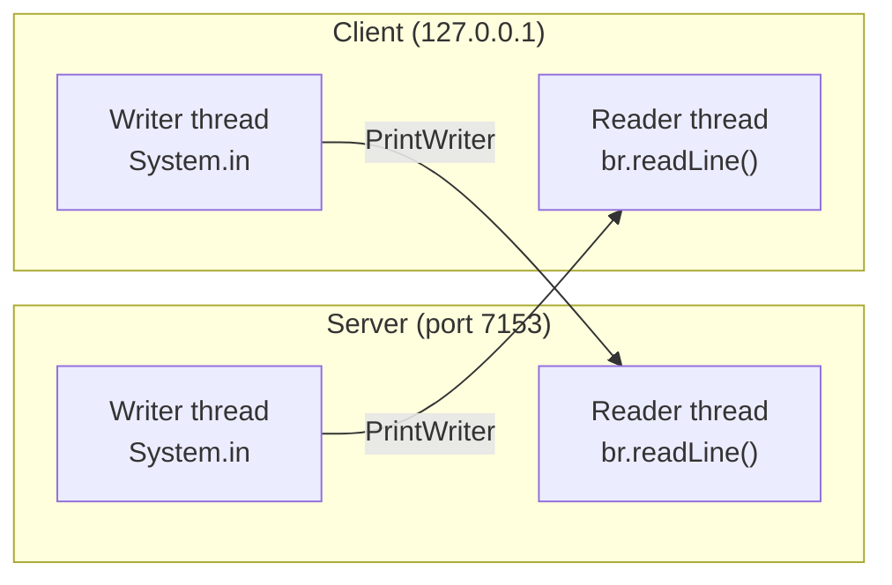

# Java Socket Chat App

A minimal two-way chat application built with core Java — `java.net` sockets and `java.io` streams, no frameworks and no external dependencies. One process acts as the **server**, one as the **client**, and once they connect both sides can type messages to each other in real time from their own terminal.

This is a learning project for understanding TCP socket programming and multithreading in Java.

---

## How it works

A chat needs to do two things at the same time: wait for the other side to say something, and let you type. A single thread can only block on one of those. So each process runs **two threads** over one shared socket:



- **Reader thread** (`StatrtReading`) blocks on `br.readLine()` waiting for data from the socket, and prints whatever arrives.
- **Writer thread** (`StartWriting`) blocks on `System.in` waiting for you to type, then pushes the line down the socket with `PrintWriter.println()` + `flush()`.

Because they're separate threads, an incoming message can appear while you're still typing — neither side has to take turns.

### Connection sequence

1. Server calls `new ServerSocket(7153)` and blocks on `accept()`.
2. Client calls `new Socket("127.0.0.1", 7153)`.
3. `accept()` returns a connected `Socket`; both sides wrap its streams in a `BufferedReader` (in) and `PrintWriter` (out).
4. Both sides spawn their reader and writer threads. Chat is live.

### Message protocol

Plain newline-delimited text. One line typed = one line sent. The single reserved word is:

| Message | Meaning |
|---|---|
| `Exit` | Ends the chat session on the receiving side |

Sending `Exit` (exact case) causes the other side's reader thread to print a termination notice and break out of its loop.

---

## Requirements

- **JDK 8 or newer.** Developed on JDK 25.

Check yours with:

```bash
javac -version
```

---

## Running it

You need **two terminals**, both in this directory. Start the server first — the client will fail to connect if nothing is listening.

**Terminal 1 — server:**

```bash
javac Server.java
java Server
```

**Terminal 2 — client:**

```bash
javac Client.java
java Client
```

Then just type into either terminal and press Enter. The message appears on the other side, prefixed with `Server:` or `Client:`.

> **Common mistake:** `javac` needs the `.java` extension, `java` must *not* have it. Running `javac Server` (no extension) gives you
> `error: Class names, 'Server', are only accepted if annotation processing is explicitly requested`.

### One-line shortcut (JDK 11+)

You can skip the compile step entirely using single-file source mode:

```bash
java Server.java     # terminal 1
java Client.java     # terminal 2
```

---

## Example session

```
Terminal 1 (Server)              Terminal 2 (Client)
─────────────────────            ─────────────────────
Server is running...
Server is waiting for client...
Waiting...
                                 Client is running...
                                 Sending request to server...
                                 Connection done...
Reader started...                Reader started...
Writer started...                Writer started...

hello there                      Server: hello there
Client: hi!                      hi!
Client: Exit                     Exit
Client has terminated
the chat session...
```

---

## Project structure

| File | Purpose |
|---|---|
| `Server.java` | Listens on port 7153, accepts one client, then reads/writes |
| `Client.java` | Connects to `127.0.0.1:7153`, then reads/writes |
| `BufferReader.java` | Empty scratch file — not part of the app |

---

## Configuration

Both the port and host are hardcoded. To change them, edit the matching pair:

- `Server.java` → `new ServerSocket(7153)`
- `Client.java` → `new Socket("127.0.0.1", 7153)`

To chat between two different machines on the same network, replace `127.0.0.1` in the client with the server machine's LAN IP.

---

## Known limitations

This is a teaching example, not production code. Current rough edges:

- **Single client only.** The server calls `accept()` once. Supporting multiple clients means looping on `accept()` and spawning a handler thread per connection.
- **Sockets are never closed.** When a reader thread breaks out of its loop, the writer thread keeps blocking on `System.in`, so the JVM never exits. You have to `Ctrl+C`. A proper shutdown would close the socket and signal the writer to stop.
- **A new `BufferedReader` is constructed on every loop iteration** in `StartWriting()`. It works, but each reader buffers ahead from `System.in`, so pasting several lines at once can drop input. It belongs above the `while` loop.
- **`catch` is inside the loop.** An error prints a stack trace and the loop continues rather than shutting down cleanly.
- **No usernames, timestamps, or message history.**
- **Typo in the method name:** `StatrtReading()` should be `startReading()`. Java convention is also `camelCase` for methods, not `PascalCase`.

---

## Possible next steps

- Loop `accept()` and give each client its own thread to support a multi-user chat room
- Broadcast: relay each client's message to all other connected clients
- Close sockets and exit cleanly on `Exit`
- Add usernames and timestamps to messages
- Move the port to a command-line argument instead of hardcoding it
